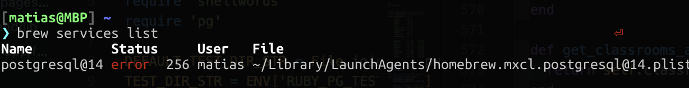
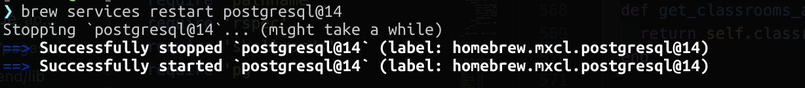
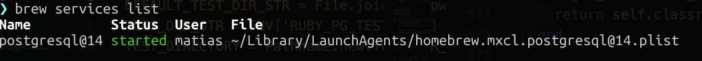

# Postgres Fixer 💻

This is a small guide to fix some issues about postgres. Sometimes the services of postgres just throw an error and it's hard to know why.



The simplest solution for this is just to restart the services of postgres.



But even when you try to do this, it stills display an error.

To solve this, I would recommend to see if there is any update to the postgres version on brew. For this, just run:

```
brew update
brew upgrade
```

But sometimes, this isn't enough. So, the solution that always works for me is to reset the postmaster.pid. To do this, just run:

```
rm -f /usr/local/var/postgresql@14/postmaster.pid
```

And then

```
brew services restart postgresql@14
```

Now you can see the results with

